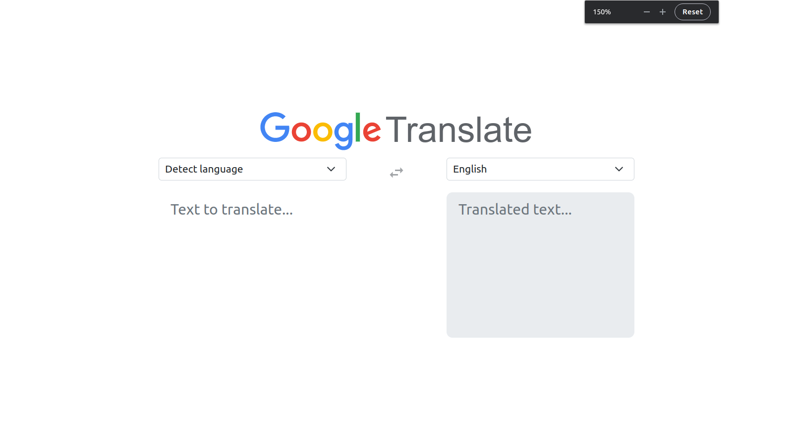

# Google Translate Clone

## Description

This is a clone of Google Translate. It is a simple web app that translates text from one language to another. It uses the OpenAI API to do the translation.

**Note:** This is a project I made to learn about the OpenAI API. It is not meant to be used for anything serious.

### Preview

## Development

Run `pnpm install` to install the dependencies. Then run `pnpm run dev` to start the development server.

Set the environment variable `VITE_OPENAI_API_KEY` to your OpenAI API key. You can get one [here](https://platform.openai.com/). See `.env.example` for an example.

This project uses [Node.js](https://nodejs.org/en/) v18.15.0 and [pnpm](https://pnpm.io/) 8.1.0 were used to develop this project. Make sure you have them installed.

### To Do

- [ ] Add validations to the textareas to prevent injection attacks.
- [ ] Create an API to call the OpenAI API. This will allow the app to be used without exposing the API key.
- [ ] Mock the OpenAI API for testing (https://vitest.dev/guide/mocking.html#functions).

## Testing

Run `pnpm test` to run the tests.
